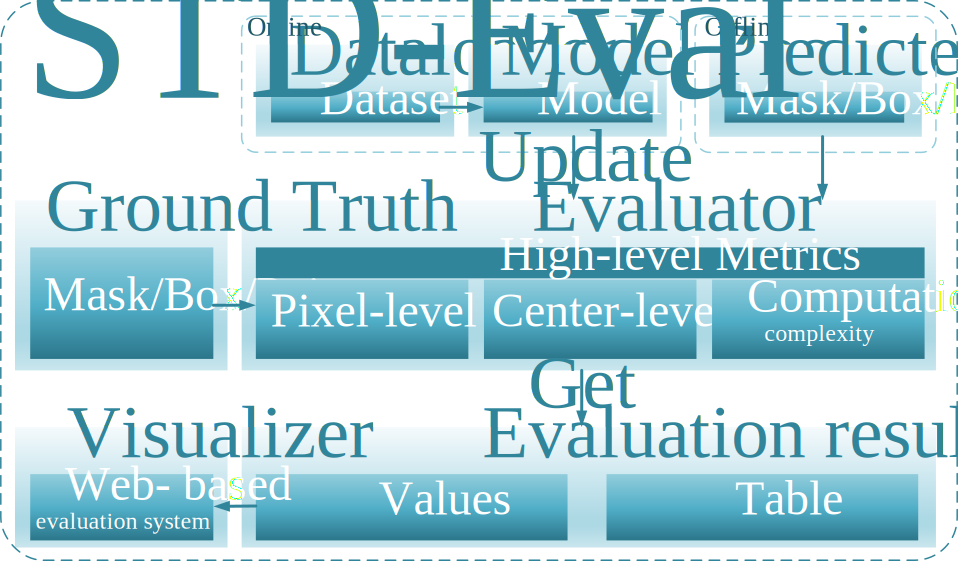

<p align="center">
<a href="https://github.com/google/yapf/actions/workflows/pre-commit.yml"></a>
</p>


<div align="center">

[English](README.md) | 简体中文

</div>



## 简介

STD EvalKit (Small Center Detection Evaluation Kit)是一个用于红外小目标分割任务的评价指标工具库。

我们统计了近年来红外小目标分割领域的评价指标([统计结果](https://github.com/IRSTD/StatOnEvalMetrics))，并实现了其中最常用的部分指标。

<details open>
<summary>主要特性</summary>

- **速度快**

    对于只能单张图像迭代计算的评价指标我们都实现了多线程版本。

- **设备友好**

    所有的指标均支持批次的自动累积。

- **接口统一**

    所有的指标提供相同的接口,`Metric.update(labels, preds)`完成批次的累积， `Metric.get()`操作完成指标的计算。

- **计算统一**

    同一类型的指标，我们使用了相同的计算逻辑与算法，保证了结果间的一致性。

- **支持的数据类型丰富**

    支持多种输入数据类型，hwc/chw/bchw/bhwc/image path 等, 具体的类型与使用方式见<div> <a href="./notebook/tutorials.ipynb">./notebook/tutorial.ipynb</a></div>


</details>

## 评价指标总览
根据评价指标计算时所需要的数据，我们将指标分为三个大类，像素级、 目标级、混合型。

<div align="center">
  <b>Architectures</b>
</div>
<table align="center">
  <tbody>
    <tr align="center" valign="bottom">
      <td>
        <b>Pixel Level</b>
      </td>
      <td colspan="2">
        <b>Target Level</b>
      </td>
    </tr>
    <tr valign="top" valign="bottom">
      <td rowspan="2">
        <ul>
            <li><a href="stdeval/metrics/pixel_level/pixel_auc_roc_ap_pr.py">AUC ROC AP PR</a></li>
            <li><a href="stdeval/metrics/pixel_level/pixel_pre_rec_f1_iou.py">Precision Recall F1 IoU (DOI:10.1109/TAES.2023.3238703)</a></li>
            <li><a href="stdeval/metrics/pixel_level/pixel_normalized_iou.py">NormalizedIoU (DOI:10.1109/WACV48630.2021.00099)</a></li>
      </ul>
      </td>
        <td align="center"><b>Center-Level</b></td>
        <td align="center"><b>Box Level</b></td>
    <tr valign="top">
      <td>
        <ul>
          <li><a href="stdeval/metrics/target_level/center_level/center_pre_rec_f1.py">Precision Recall F1 (DOI:10.1109/TAES.2022.3159308)</a></li>
                    <li><a href="stdeval/metrics/target_level/center_level/center_ap.py">Average Precision (Ours)</a></li>
            <li><a href="stdeval/metrics/target_level/center_level/center_pd_fa.py">Pd_Fa (DOI:10.1109/TIP.2022.3199107)</a></li>
            <li><a href="stdeval/metrics/target_level/center_level/center_roc_pd_fa.py">ROC Pd_Fa</a></li>
            <li><a href="stdeval/metrics/target_level/center_level/center_normalized_iou.py">Center Normalized IoU (Ours)</a></li>
        </ul>
      </td>
      <td>
        <ul>
            <li><a href="stdeval/metrics/target_level/box_level/box_mean_ap_ar.py">Mean Average Precision, Recall (COCO)</a></li>
        </ul>
      </td>
    </tr>
</td>
    </tr>
  </tbody>
</table>

## 安装
```bash
git clone git@github.com:IRSTD/STD-EvalKit.git
```
```bash
cd STD-EvalKit
```
开发者模式安装(可以更方便的debug)
```bash
pip install -e .
```
或者只使用
```bash
pip install stdeval
```


## 教程
```python
from stdeval.metrics import PixelPrecisionRecallF1IoU
Metric = PixelPrecisionRecallF1IoU(
    conf_thr=0.5,
    )
Metric.update(labels=labels, preds=preds.sigmoid())
precision, recall, f1_score, iou = Metric.get()
```
更多的使用细节: <div><a href="./notebook/tutorials.ipynb">./notebook/tutorial.ipynb</a></div>
